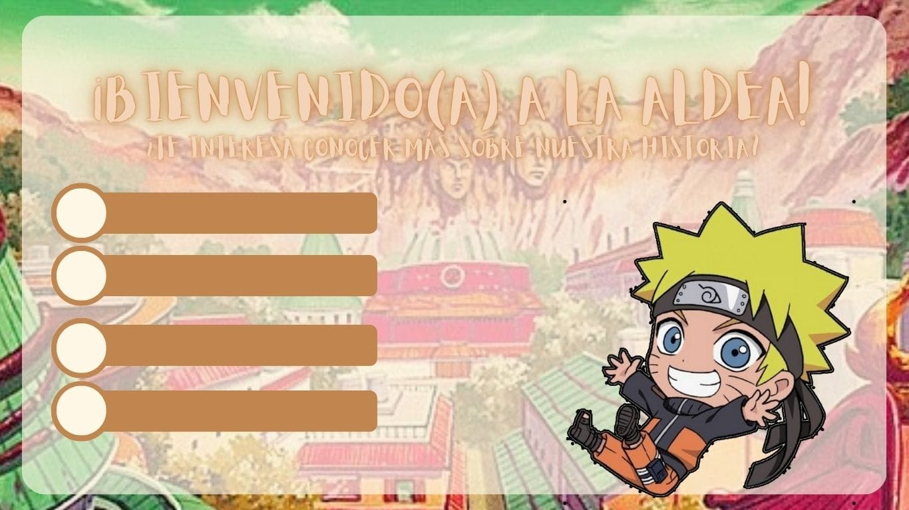
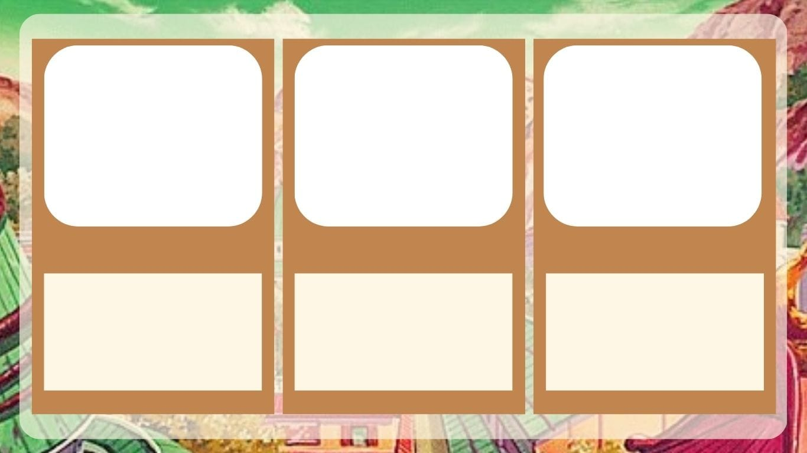
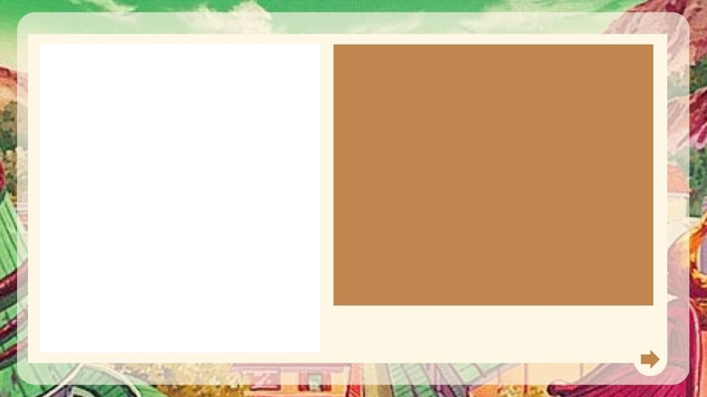
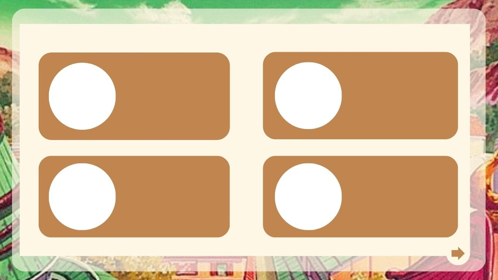

# Naruto Word

¡Hola, querido(a) ninja! Si estás aquí, es porque deseas conocer más sobre nuestra aldea y la serie de Naruto. ¡Has llegado al lugar correcto!

## Objetivo del Proyecto

El objetivo principal de este proyecto es recolectar y presentar información sobre la serie Naruto de manera dinámica y atractiva para los fans del anime. Queremos ofrecer una experiencia visual y entretenida para que puedas disfrutar conociendo más sobre tu anime favorito.

## Historia del Proyecto

### ¿Cómo surge la idea de esta web?

La idea de este proyecto nació al darnos cuenta de la extensa cantidad de información disponible sobre Naruto. Decidimos compilarla y organizarla de manera entretenida para ofrecer una plataforma más accesible y divertida para los fans.

### Bocetos y Diseño

Para comenzar, creamos una serie de bocetos que nos ayudaron a visualizar y organizar la estructura de la web. Aquí te mostramos algunos de nuestros bocetos iniciales:

#### Boceto General

#### Bocetos de Secciones

- **Boceto de Sección 1**

  

- **Boceto de Sección 2**

  

- **Boceto de Sección 3**

  

Estos bocetos nos sirvieron como referencia para organizar la información, diseñar plantillas y asegurar una navegación fluida en el sitio.

## Objetivos del Proyecto

Con la **Web de Naruto**, se podrá encontrar de manera organizada los listados de personajes que conforman la serie de Naruto de manera dinámica.

## Descripción del Producto

La web está diseñada para ofrecer una experiencia interactiva al explorar los personajes de Naruto, permitiendo a los usuarios aprender más sobre sus clanes y aldeas.

## Guía para los Usuarios

1. **Paso 1:** Al ingresar a la web, encontrarás una portada donde el personaje principal de dicho anime te invita a recordar y conocer los diferentes personajes que lo acompañan a lo largo del show.
2. **Paso 2:** Después de hacer clic en el botón "Recordar", serás llevado a la página de inicio, donde podrás ver a todos los personajes agregados en la serie.
3. **Paso 3:** En la pantalla, encontrarás una lista de 3 botones que categorizan a los personajes dependiendo de su clan y aldea.
4. **Paso 4:** Al seleccionar una categoría, podrás explorar cómo fueron categorizados los personajes.
5. **Paso 5:** Ahora solo queda explorar esta breve página interactiva.

## Problemática del Usuario

### **Dificultades para Conocer Personajes**

Imagina que eres un gran fan de Naruto, pero cada vez que intentas recordar o aprender más sobre los personajes, te sientes abrumado por la cantidad de información dispersa que encuentras en Internet. Desde sus historias y habilidades hasta los clanes a los que pertenecen, navegar por todo eso puede resultar agotador y confuso. Muchos fans terminan frustrados, sin saber por dónde empezar o qué detalles son realmente relevantes.

## Solución Propuesta

### **Una Experiencia Interactiva y Amigable**

Con nuestra **Web de Naruto**, queremos eliminar esas frustraciones. Hemos diseñado una plataforma sencilla y atractiva donde puedes explorar todos los personajes de Naruto de manera clara y organizada. Al entrar, te damos la bienvenida con un recorrido visual que te invita a recordar y conocer más sobre tus personajes favoritos.

Podrás filtrar a los personajes según su clan o aldea, facilitando que encuentres rápidamente la información que buscas. Ya sea que desees profundizar en la historia de los Uchiha o aprender sobre los habitantes de Konoha, nuestra web está aquí para hacer tu experiencia más divertida y accesible.

Así, podrás disfrutar de la rica historia de Naruto sin la carga de la confusión, ¡todo con un solo clic!

## Estructura de la Web

| Sección         | Descripción                                              
|-----------------|----------------------------------------------------------|
| **Portada**     | Página de bienvenida con una invitación del protagonista | 
| **Página de Inicio** | Lista de todos los personajes de la serie                 
| **Categorías**  | Botones para filtrar personajes por clan y aldea         | 

## Datos y Estadísticas

Para proporcionar una visión más clara de la información que se presenta, aquí tienes algunos gráficos y tablas que resumen la estructura y el contenido de la web:

### Distribución de Personajes por Clan

| Clan           | Número de Personajes |
|----------------|-----------------------|
| **Uchiha**     | 15                    |
| **Senju**      | 10                    |
| **Hyuga**      | 8                     |
| **Aburame**    | 6                     |

### Distribución de Personajes por Aldea

| Aldea          | Número de Personajes |
|----------------|-----------------------|
| **Konoha**     | 25                    |
| **Suna**       | 8                     |
| **Iwa**        | 5                     |
| **Kiri**       | 7                     |

### 🔨  Stack 

####   

### Creado por:
**@LucianaCarrasco**
**@alexandra0213**
**@GuadalupeCampos**
**@Katerinrojas**

